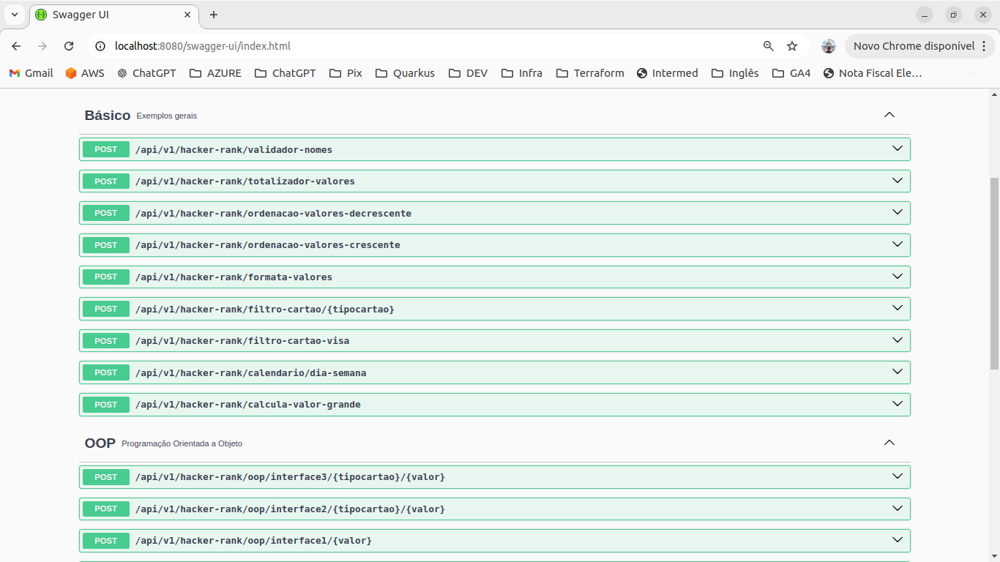

# Exemplos de exercício do site Hacker-rank

https://www.hackerrank.com/domains/java


## 💻 Getting started

```bash
# Build 
$ mvn clean package

# Local execution
$ mvn quarkus:dev -Ddebug=false
```


## Getting started Docker
```bash
# Install image from file build_docker_push.sh 
$ ./build_docker_push.sh 

# Started and attaches to containers for a service
$ docker-compose --env-file ./.env up
```


## ✔️ Required
* Maven: 3.8.4
* Java version: 21


# Teste Local

http://localhost:8080/swagger-ui/index.html



# Autor
Reinaldo Jesus Santana - reinaldojsantana@gmail.com
